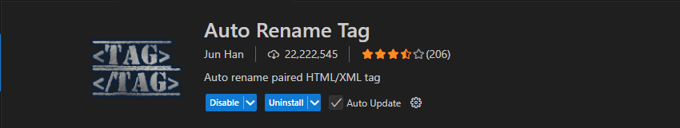
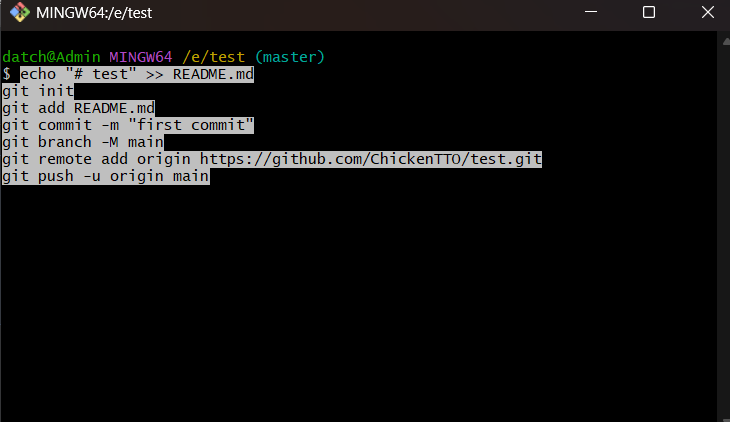
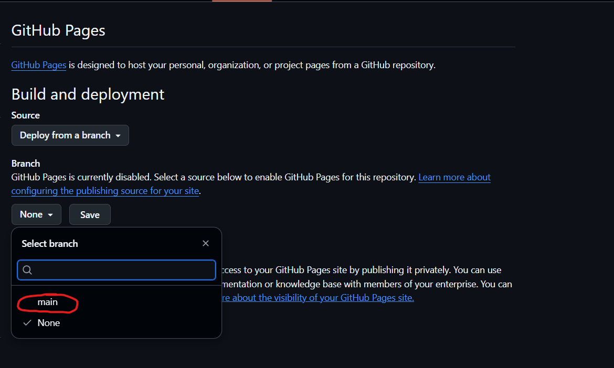

# Lộ trình lớp web public hè 2025
***
#### Buổi 1 : Giới thiệu cài đặt IDE và Extensions
#### Buổi 2: Cấu trúc HTML cơ bản & Semantic HTML
#### Buổi 3: Giới thiệu CSS & Cách style cơ bản
#### Buổi 4: Làm việc với Font, Biến, Bộ chọn & Quy tắc đặt tên trong CSS
#### Buổi 5:Kỹ thuật chia layout với Flexbox
#### Buổi 6: Position, Animation, Transition
#### Buổi 7: CSS Grid & Thiết kế giao diện Responsive
#### Buổi 8: Ôn tập tổng hợp & Kiểm tra cuối khóa
***


## Buổi 1: Giới thiệu cài đặt IDE và Extensions
***
#### I. Cài đặt IDE, Extensions
---
##### 1. IDE
[Visual studio code](https://code.visualstudio.com/)
##### 2. Extensions
- HTML CSS Support 


- Live sever 


- Auto Close Tag


- Auto Rename Tag



#### II. Git & Github
---
##### 1. Git

a. Git là gì? Git là hệ thống quản lý phiên bản phân tán (VCS - Version Control System), giúp bạn theo dõi mọi thay đổi trong mã nguồn của dự án, từ đó có thể hợp và làm việc nhóm một cách dễ dàng và hiệu quả

b. Tại sao cần dùng Git

 - Theo dõi sự thay đổi của dự án
 - Dễ dàng quay lại phiên bản trước đó nếu có lỗi
 - Hỗ trợ làm việc nhóm nhiều người trên cùng 1 dự án

c. Khái niệm cơ bản

- Repo (Repository): kho lưu trữ mã nguồn, nơi chứa toàn bộ các file và lịch sử thay đổi của dự án
    - Local repo: Đây là repo được thiết lập trên máy của lập trình viên và dành cho 1 người sử dụng
    - Remote repo: Đây là repo để chia sẽ giữa nhiều người và bố trí trên server chuyên dụng
- Branch: Tương tự như một workspace mới mà không ảnh hưởng tới nhánh chính
- Commit: là hành động ghi lại sự thay đổi trong repo của bạn
- Clone: là hành động tải một bản sao có sẵn của một remote repo server nào đó có sẵn
- Push: là hành động đưa các commit từ local repo lên remote repo

d. Cài đặt Git

1. [Dowload Git](https://git-scm.com/downloads?ref=blog.haposoft.com)

2. Thiết lập thông tin cá nhân của mình với Git

- Mục đích của việc thiết lập thông tin cá nhân trên Git (bao gồm tên và địa chỉ email) là để Git có thể xác định người thực hiện các hành động trong quá trình quản lý phiên bản (version control). Tức là khi thực hiện một commit trong Git, thông tin cá nhân như tên và email sẽ được ghi lại cùng với commit đó.
```c
git config --global user.name "Tên của bạn"
git config --global user.email "email@example.com"
git config --list
```
3. Các lệnh cơ bản khi dùng `Git`

- Khởi tạo và sao chép
```c
git init                     # Khởi tạo repo Git mới
git clone <url>              # Sao chép một repo từ GitHub/GitLab...
```
- Theo dõi và thay đổi
```c
git status                   # Kiểm tra trạng thái file
git add <file>               # Thêm file vào staging area
git add .                    # Thêm tất cả file vào staging
git commit -m "Thông điệp"   # Tạo commit mới
```
- Đẩy và lấy dữ liệu
```c
git push                     # Đẩy code lên repository 
git push origin main         # Đẩy code lên nhánh main
git pull                     # Kéo code mới nhất từ repo về
```
- Quản lý nhánh (Branch)
```c 
git branch                   # Liệt kê các nhánh
git branch <ten-nhanh>       # Tạo nhánh mới
git checkout <ten-nhanh>     # Chuyển sang nhánh khác
git checkout -b <ten-nhanh>  # Tạo và chuyển sang nhánh mới
git merge <ten-nhanh>        # Gộp nhánh vào nhánh hiện tại
git branch -d <ten-nhanh>    # Xoá nhánh đã gộp
```
##### 2. Github
a. Github là gì? 
- GitHub là một nền tảng dựa trên web được thiết kế để lưu trữ mã nguồn và hỗ trợ quản lý phiên bản (version control) bằng cách sử dụng Git. Nó cung cấp không gian lưu trữ cho các dự án mã nguồn (repository) và các công cụ để quản lý, theo dõi và làm việc trong các dự án phần mềm. 

b. Liên kết Git và Github

- Khi liên kết Git và Github, mã nguồn sẽ được lưu trữ online, tức bạn có thể truy cập đến mã nguồn của mình từ bất cứ đâu, chỉ cần có mạng Internet
- Giúp sao lưu dữ liệu tránh trường hợp dữ liệu bị mất hay máy tính hỏng học
- Giúp chia sẻ mã nguồn và làm việc nhóm với các công cụ, tính năng giúp kiểm soát mã nguồn, xử lý lỗi
1. Tạo tài khoản Github và tạo repo mới
- Sau khi tạo tài khoản để tạo một repo mới làm được nhấn vào button `new` như hình này: 


- Sau khi vào trang chính của tạo repo chúng ta đặt tên cho repo chuẩn bị tạo bằng cách nhập tên vào ô `input` như hình": 


- Cuối cùng kéo xuống dưới và nhấn vào `Create repository`: 


2. Kết nối folder trong máy tính với repo trên Github

B1: Tạo một folder bất kỳ trên Laptop 


B2: Click chuột phải vào folder vừa tạo chọn `Show more options` sau đó chọn `Git Bash`:


B3: Sau khi hiển thị bảng như hình 


thì chúng ta copy code ở gitHub vào đó 

 

 

B4: Sau khi code chạy xong load lại trang ở gitHub

3. Github Page

B1: mở folder vừa tạo trong VS code.
B2: Tạo một file có tên là `index.html`.
B3: Copy đoạn code sau vào file vừa tạo.

```c
<!DOCTYPE html>
<html lang="en">
<head>
    <meta charset="UTF-8">
    <meta name="viewport" content="width=device-width, initial-scale=1.0">
    <title>Document</title>
</head>
<body>
    <h1>Hello anh em</h1>
</body>
</html>
```

B4: Quay trở lại gitHub sau đó nhấn vào mục `Setting`

 

B5: Chọn vào phần Page 


B6: Ở phần `Branch` chọn `main` như ảnh:



B7: Nhấn vào button `Save` bên cạnh
B8: Đợi 1 lúc sau đó nhần vào `Visit site`


B9: Thêm `index.html` (tên file vừa tạo ở bước 2)


#### III. HTML, CSS
---
1. HTML
- HTML (HyperText Markup Language) là ngôn ngữ đánh dấu được sử dụng để tạo cấu trúc và nội dung cho một trang web.
- HTML không phải là ngôn ngữ lập trình mà là ngôn ngữ đánh dấu để sắp xếp các thành phần như văn bản, hình ảnh, liên kết, biểu mẫu, và các nội dung khác trên trang web.

2. CSS
- CSS (Cascading Style Sheets) là ngôn ngữ dùng để mô tả cách hiển thị của các phần tử HTML trên trang web.
- Nó quyết định về bố cục, màu sắc, kiểu chữ, kích thước, khoảng cách giữa các phần tử, v.v. CSS giúp trang web trông trực quan và dễ nhìn hơn.
---